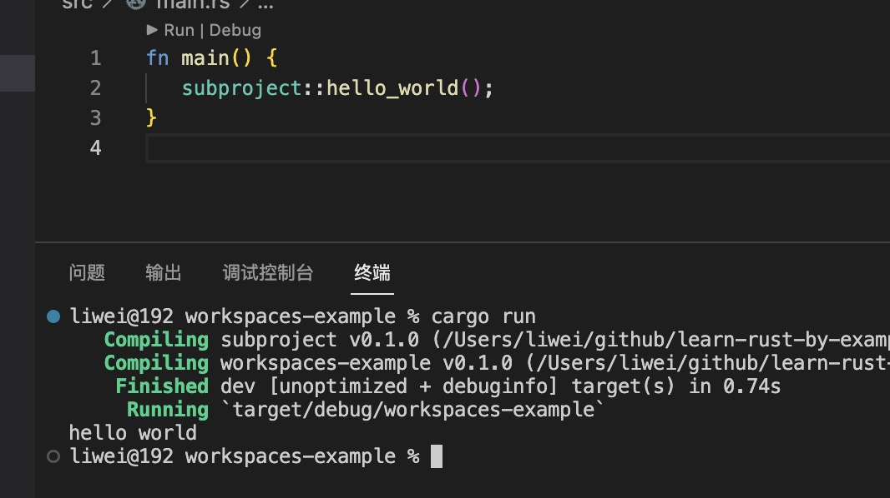

1. Cargo 的workspace功能允许您将一个大板条箱分成单独的板条箱。(例如：ethereum-rs 库)

   工作区是一个或多个包（称为工作区成员）的集合，这些包被一起管理

   工作空间的要点是：

+ 通用命令可以在所有工作区成员上运行，例如cargo check --workspace.

+ Cargo.lock所有包共享一个驻留在 工作空间根目录中的公共文件。
所有包共享一个公共输出目录，该目录默认为工作区根目录target中命名的目录。

+ 共享包元数据，例如与workspace.package.

+ 中的[patch]、[replace]和[profile.*] 部分仅在根Cargo.toml清单中被识别，而在成员 crate 的清单中被忽略。


2. 创建一个workspace 项目


    ```rust
    cargo new workspaces-example

    // 进入目录
    cd workspaces-example

    // 创建一个子项目lib
    cargo new subproject --lib

    ```

    项目目录结构：

    

2. 接下来，让我们通过将子项目添加为依赖项来更新顶层Cargo.toml以包含子项目：

    ```rust
    [dependencies]
    subproject = { path = "./subproject" }
    ```

    >`指定工作区中所有 crate 的另一种方法是使用[workspace.members]，它可以包含工作区成员的路径列表或全局模式。对于较大的项目，这可能比明确列出每个路径更容易。对于此示例，中的替代代码Cargo.toml如下所示：`

    ```rust
    [workspace]
    members = [
        "subproject",
    ]
    ```

    您现在可以运行cargo check以确保所有内容都可以编译且没有任何错误。

3. 在subproject 公开一个函数

   在subproject/src/lib.rs 中

   ```rust
   /// 使用pub 公开，方便其他模块调用
    pub fn hello_world(){
        println!("hello world");
    }
    ```

    在src/main.rs 中调用

    ```rust
    fn main() {
        subproject::hello_world();
    }
    ```

    
