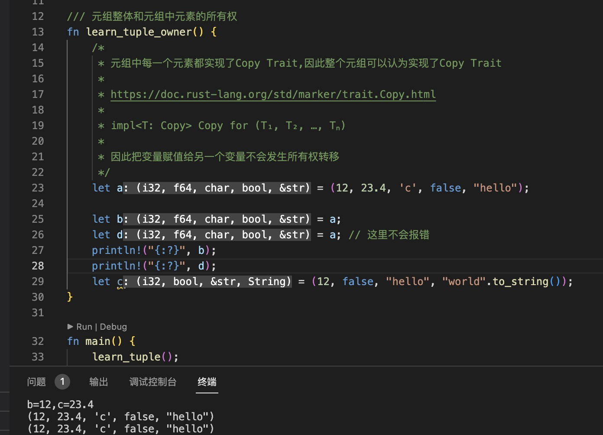
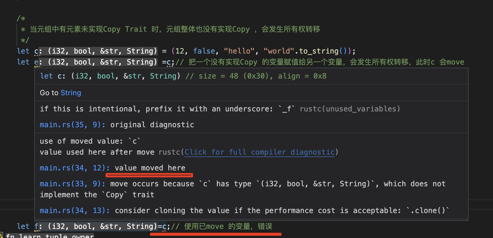
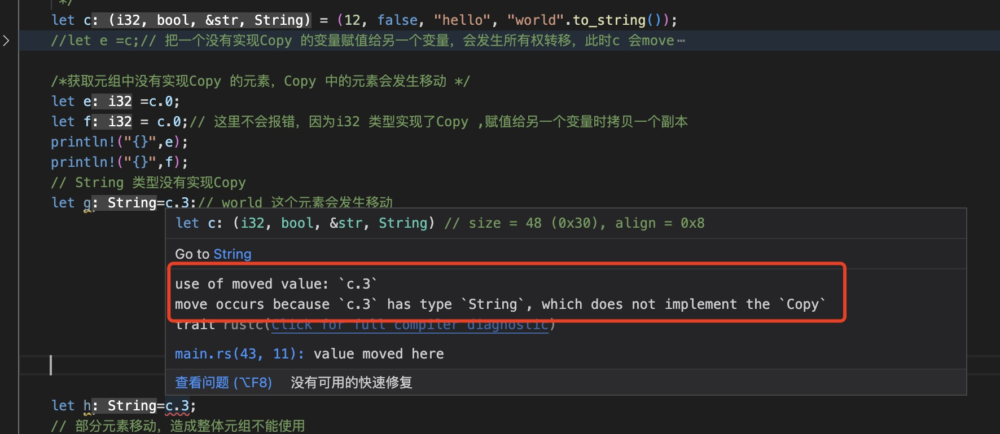
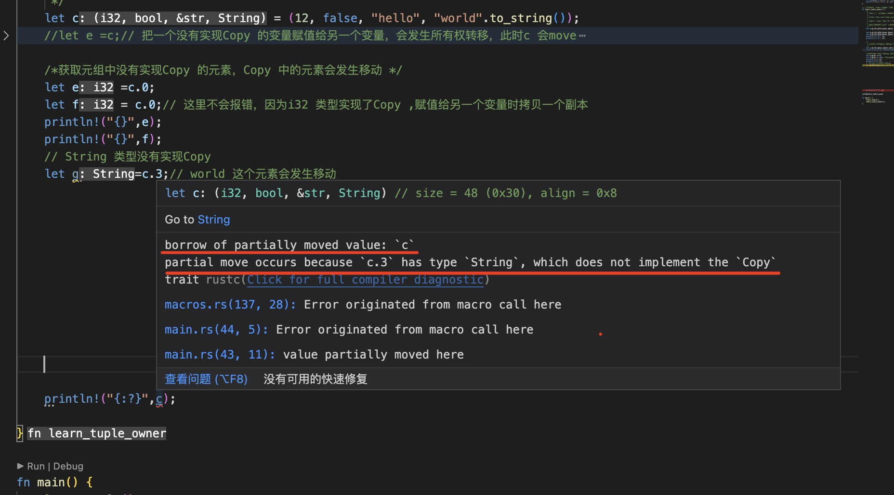
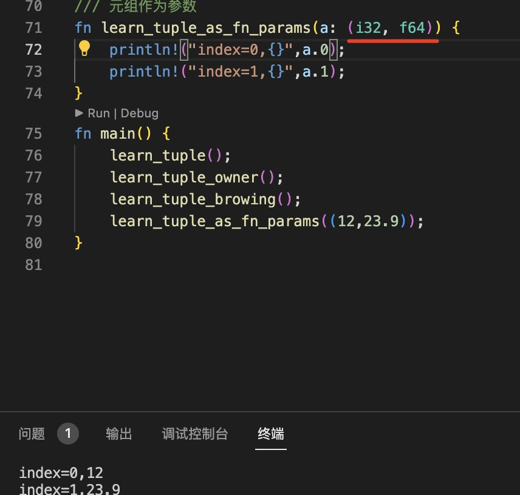
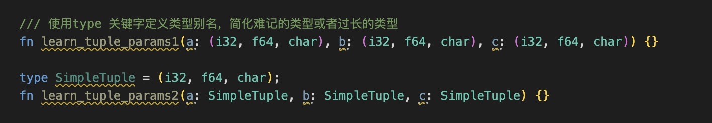
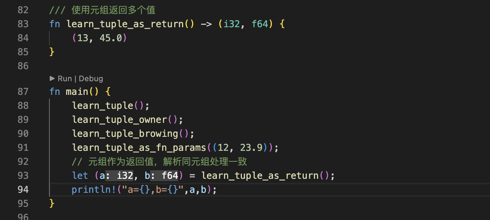
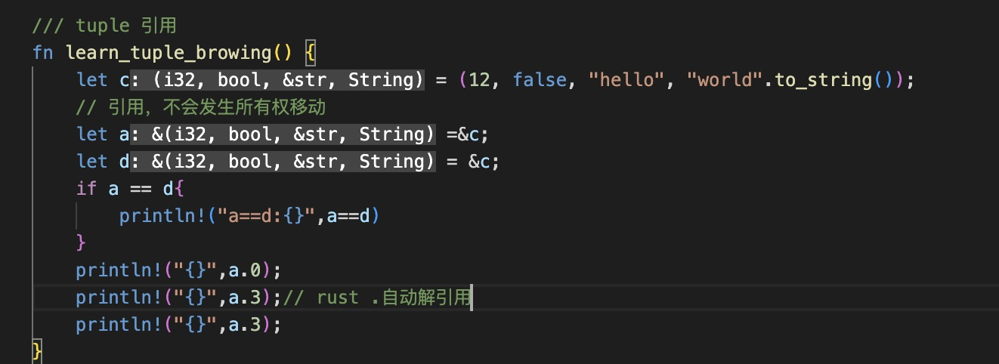
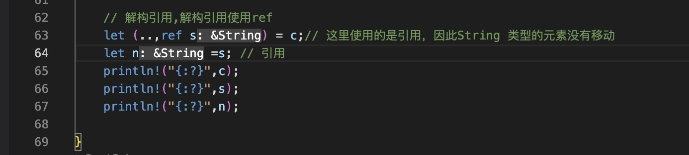

1. 在rust 中元组使用()表示,里面的元素可以是不同的类型

   定义元组类型时，需要声明每一个元素的类型

   ```rust
    let tuple:(i32,&str,char,f64) = (12,"hello",'c',45.7);
   ```

2. 获取元组中的元素

+ 使用元组索引下标，下标从0开始

   ```rust
    let a = (12,23.4,'c',false,"hello","world".to_string()); // rust 变量类型推导
    // 使用数组下边获取元素数据
    let b = a.0;
    println!("index 0={}",b);
    ```

+ 元组解构

   ```ts
    // 使用元组解构
    let (b,c,..) = a;
    println!("b={},c={}",b,c);
    ```

    + 元素解构是按照下标一一对应的解析

    + 使用.. 可以忽略对应多个位置的元素解析

    + 使用下划线忽略单个元素的解析

3. 元组整体和元素中每个元素的所有权

+ 当元组中所有元素都实现了Copy Trait 的时候，整个元组属于实现了Copy 的

   

+ 当元组中有元素没有实现Copy Trait 的时候，整个元素属于没有实现Copy 的，赋值给其他变量或者作为参数时，所有权会发生移动

   

+ 当获取元组中元素时，如果改元素没有实现Copy Trait ,那么此时会发生移动，类似把当前元素赋值给一个变量

   + 元素移动，不能再使用原来的元素

     

   + 元素移动以后，造成元组部分元素移动，不能再完整使用

      

4. 元组作为函数参数

   

   >`当使用元组当做参数时，如果元素中元素较多，而且可能需要的参数是不同类型的元组，此时可以使用type 关键字定义 别名简化参数类型`

   

5. 函数可以使用元组返回多个值，因为元组可以保存任意数量的值。`但是必须声明元组中每个元素的类型`

   


6. 元组引用

+ 元组和下标引用

   

+ 解构引用，使用ref

   

7. 示例：解决同类型的两个数的交换


   

    